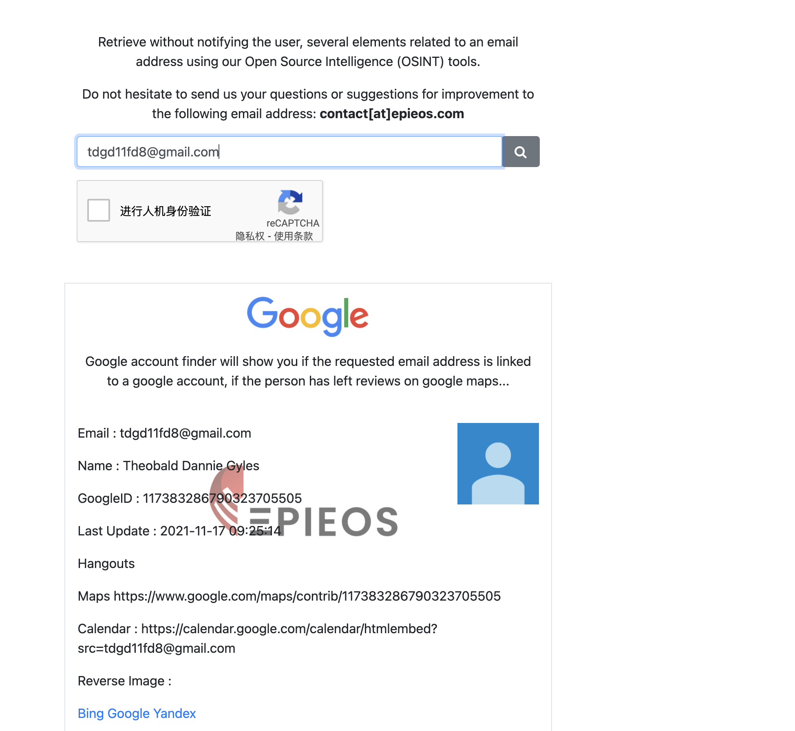

# PRETTY GOOD PHISHER

*This phisher thinks he's the game! We got his PGP Key ID from his phishing e-mail, and we know for sure that he has another PGP key publicized under his real name! Can you find out more about him?*

*A2DCB36111E3656B*

---

题目给了一个人的PGP密钥ID,要求我们找到他另一个以真名公开的PGP密钥

在[https://keyserver.pgp.com/](https://keyserver.pgp.com/vkd/SubmitSearch.event?SearchCriteria=A2DCB36111E3656B&EmailOrName=3&SearchType=0)上检索,得到邮箱`tdgd11fd8@gmail.com`

在[OSINT Tool](https://tools.epieos.com/email.php)上搜索该邮箱,得到用户名是`Theobald Dannie Gyles`

在[https://keyserver.pgp.com/](https://keyserver.pgp.com/vkd/SubmitSearch.event)上搜索包含该用户名的PGP密钥,即可得到flag

**flag:**`TFCCTF{Pee,G...Pee!_w4s_wh4t_th4t_h3_t0ld_m3....!}) `