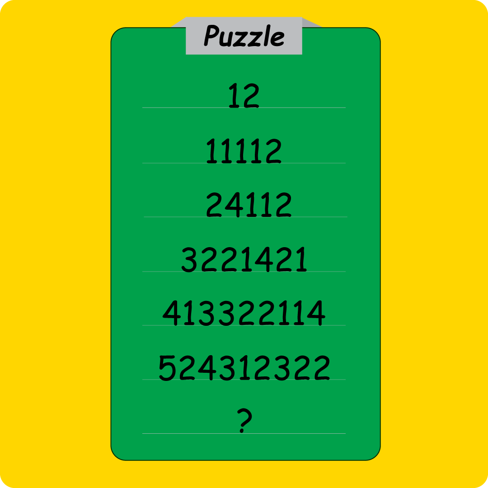

# Puzzle

*Life is a puzzle!*

---

给了一张图片,首先使用`binwalk`提取一下文件,得到一个有密码的压缩文件和一张图片.

观察图片发现,第一位数字表示行号,剩下的数字是在描述上一行数字的个数.

例如,从12->11112是:先写一个1表示行号,上一行有1个1、1个2,加上11和12即可得到11112.

依次类推,得到压缩包的解压密码`?`是`61542142311`.

输入密码,解压得到`flag.txt`:

`R1pIUEdTe1EzeV9NM19RNDU3NHpfRTRzNzBfVzRhX1U0el9PMV9RM3kwX1c0YV9QdTAwYV9YMGE0en0=`

base64解码一下:

`GZHPGS{Q3y_M3_Q4574z_E4s70_W4a_U4z_O1_Q3y0_W4a_Pu00a_X0a4z}`

ROT13解密一下:

`TMUCTF{D3l_Z3_D4574m_R4f70_J4n_H4m_B1_D3l0_J4n_Ch00n_K0n4m}`

**flag:**`TMUCTF{D3l_Z3_D4574m_R4f70_J4n_H4m_B1_D3l0_J4n_Ch00n_K0n4m}`

