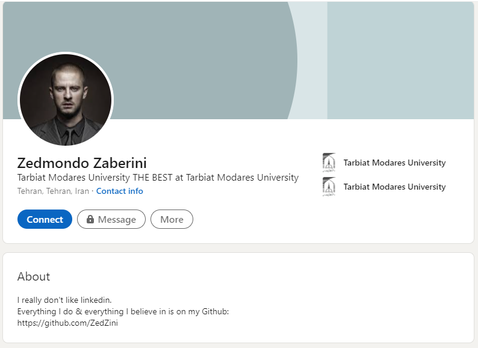

# The Foreign Student

*Tarbiat Modares University has a foreign student. His name is Zedmondo. He has a* 
*very shady character. He always walks alone, eats alone, and never talks much.* 
*There are some rumors about him. Some people say he is a genius sociopath;* 
*some say he is just too self-involved. But one thing is obvious; he has a secret.* 
*Once, one of the students heard that he was talking about receiving some* 
*important documents via a private email. Maybe if we find his email, we can* 
*learn about his secret.*

---

题目是要我们找一个叫`Zedmondo`的大学生的`private email`

首先,用Google搜索`Zedmondo Tarbiat Modares University`,找到这个人的[Linkedin主页](https://ir.linkedin.com/in/zedmondo-zaberini-203b33206)



除了一个Github链接外([https://github.com/ZedZini](https://github.com/ZedZini)),没有什么其他有价值的信息

浏览Github上的仓库,结合题目中的`he has a secret.`,一个仓库(https://github.com/ZedZini/secretkey)的`README`引起了我的注意.

```
# secretkey
It is a public key. Not really a secret, right?!
```
与`README`一起的还有一个[PGP公钥文件](https://github.com/ZedZini/secretkey/blob/main/0xEB0B6528-pub.asc):
```
-----BEGIN PGP PUBLIC KEY BLOCK-----
Version: Keybase OpenPGP v1.0.0
Comment: https://keybase.io/crypto

xsFNBGAqSQ8BEADZtFG6grS2QP9afsA7SmT85TpxcSmG5LGLmSHKgI47ZwS+dPrO
SzChR0Jt3vI7BjA3WVlxQp94XTqRqFrjtJkS2I3nO3I94jhLu0AwfoiskKzyl+tQ
...
-----END PGP PUBLIC KEY BLOCK-----
```

访问https://keybase.io/crypto,发现网站上已经给出了使用说明:

```shell
Using the Keybase command line app
keybase pgp encrypt -m "message" [them]
With GPG or another PGP program
You may import from Keybase to GPG easily and then perform whatever cryptographic actions you want.

# using curl
curl https://keybase.io/[them]/key.asc | gpg --import

# using `keybase pgp pull` which
# imports to GPG key chain for you
keybase follow [them]
keybase pgp pull [them]
```

参照使用说明:

```shell
curl https://raw.githubusercontent.com/ZedZini/secretkey/main/0xEB0B6528-pub.asc | gpg --import

  % Total    % Received % Xferd  Average Speed   Time    Time     Time  Current
                                 Dload  Upload   Total   Spent    Left  Speed
  0     0    0     0    0     0      0      0 --:--:-- --:--:-- --:--:--     0  
gpg: 目录‘/Users/zhaoqi219/.gnupg’已创建
gpg: 钥匙箱‘/Users/zhaoqi219/.gnupg/pubring.kbx’已创建
100  6139  100  6139    0     0   4494      0  0:00:01  0:00:01 --:--:--  4490
gpg: /Users/zhaoqi219/.gnupg/trustdb.gpg：建立了信任度数据库
gpg: 密钥 586DD615EB0B6528：公钥 “Zedmondo Zaberini (Nothing to say...) <Z3dm0nd0_Z4b3r1n5k1_15_My_R34l_N4m3@zaberini.com>” 已导入
gpg: 处理的总数：1
gpg:               已导入：1
```

**flag:**`TMUCTF{Z3dm0nd0_Z4b3r1n5k1_15_My_R34l_N4m3@zaberini.com}`

