## 某医院小程序接口逆向分析
最近使用某医院小程序时，发现只能查询最近半年的检查报告。那么有没有可能通过修改请求参数，获取到更早时间的检查报告呢？

<!-- more -->

## 环境&工具
* [WeChat 3.8.9](https://weixin.qq.com/)
* [Proxifier](https://www.proxifier.com/download/)
* [Brup Suite](https://portswigger.net/burp/communitydownload)
* `pip install pycryptodome`
* [Node.js](https://nodejs.org/en/download/)
```shell
~$ node -v
v18.17.0
~$ npm -v
10.9.1
```

## 配置Brup Suite
1. Proxy -> Proxy Settings -> Import/export CA certificate -> Certificate in DER format,选择CA文件的路径并命名为`xxx.crt`
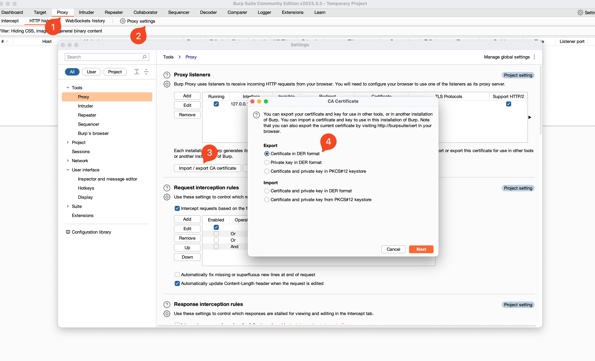
2. 双击生成的CA文件，导入钥匙串
3. 双击`PortSwiger CA`,信任设置为"始终信任"
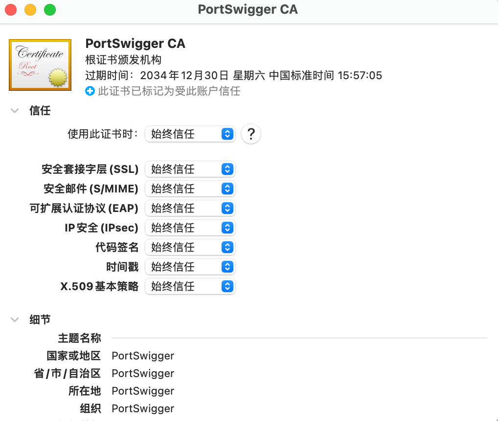

## 配置Proxifier

1. 配置Proxy: 依次点击`Rules` -> `Add`,地址为`127.0.0.1`,端口为`Brup Suite`对应的端口
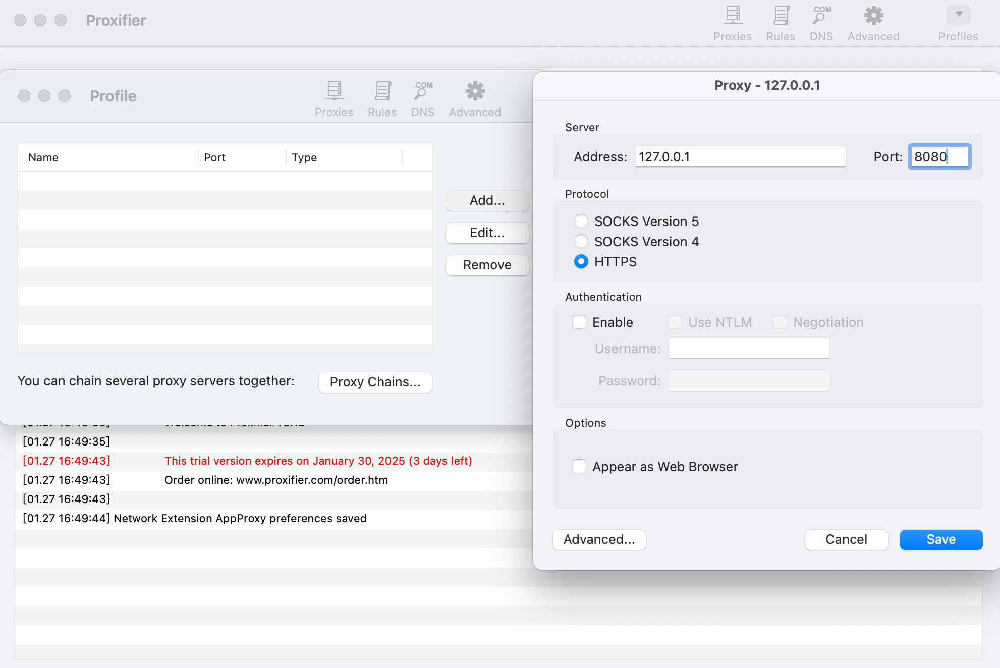
1. 配置Rule: 依次点击`Rules` -> `Add`-> `+`,选择`WeChatAppEx Helper.app`
    > 快捷键command+shift+G搜索`/Applications/WeChat.app/Contents/MacOS/WeChatAppEx.app/Contents/Frameworks/WeChatAppEx Framework.framework/`,点击`Helpers`

    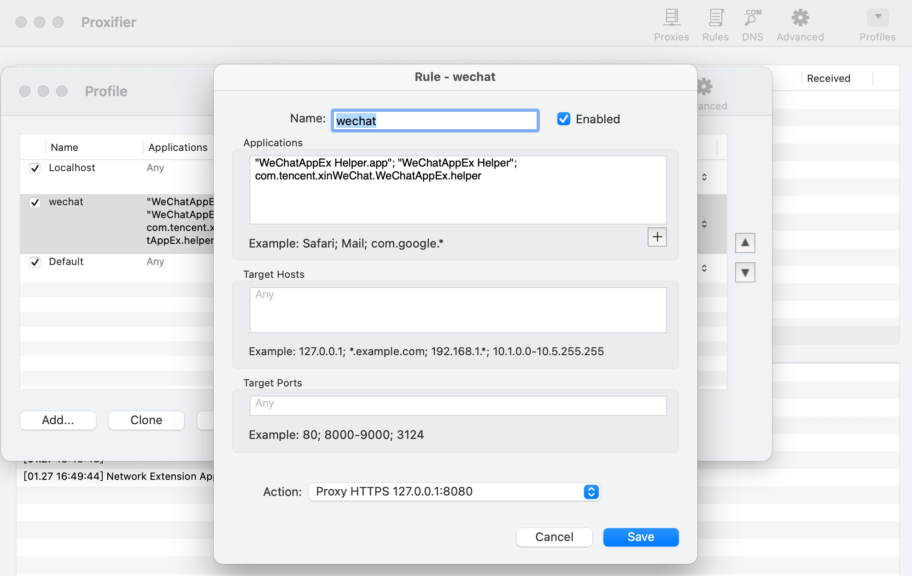
    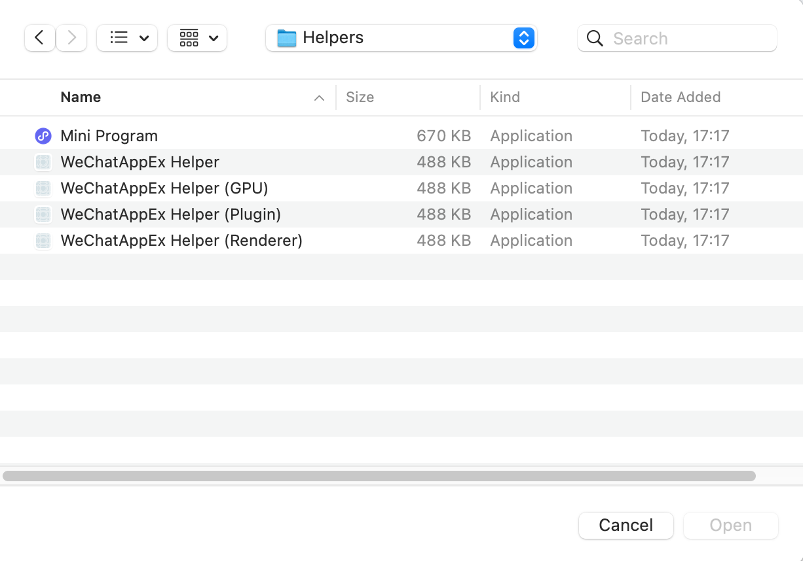
3. 打开Brup Suite和WeChat小程序,此时已经可以看到小程序发出的网络请求

## 小程序反编译
1. 进入目录`~/Library/Containers/com.tencent.xinWeChat/Data/.wxapplet/packages/`,会看到一堆命名为wx开头的`{AppID}`的文件夹,找到对应🏥小程序所在的目录
   * 可删除所有wx开头的`{AppID}`文件夹后，重新打开🏥小程序
   * 也可在移动端`Wechat`->开发者资料->`AppID`中直接获取AppID
2. 进入`{AppID}`所在目录，找到名为`__APP__.wxapkg`的文件
3. 准备`wxappUnpacker`环境
    ```shell
    git clone https://gitee.com/ksd/wxappUnpacker.git
    cd wxappUnpacker
    npm install
    npm install esprima
    npm install css-tree
    npm install cssbeautify
    npm install vm2
    npm install uglify-es
    npm install js-beautify
    ```
4. 执行反编译,得到小程序源码,可能会出现`TypeError: subPackage.pages is not iterabl`的报错，忽略即可
    ```shell
    ~$ ./bingo.sh ../__APP__.wxapkg
    ```
## 代码审计
1. 比较相邻2次请求,发现除请求参数外,只有`X-Api-Key`和`Request-No`不同
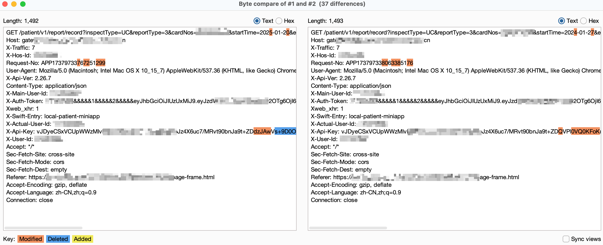
2. `Request-No`盲猜是请求序号,直接在`app-server.js`中搜索`X-Api-Key`
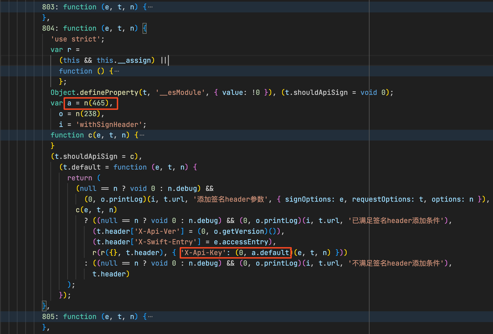
3. 找到`a`对应的`n(465)`函数,发现最终调用了`i.encrypt`方法,`p`应该是用来计算`hashDigest`
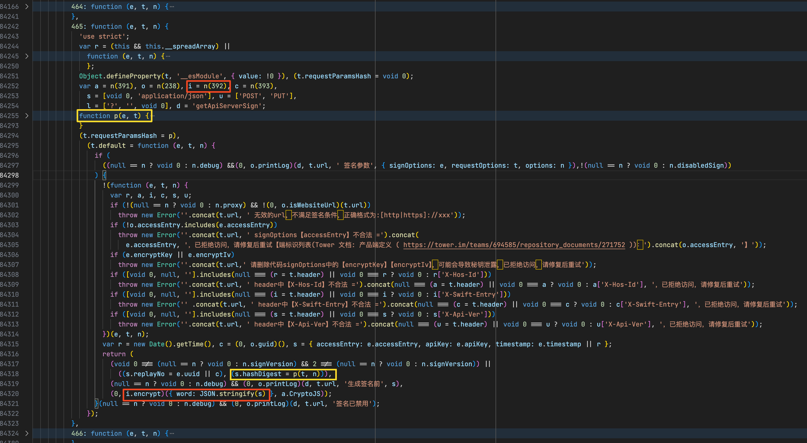
4. 分析`p(e, t)`函数,`f`数组由以下几部分组成:
* pathname + query
* `i.REQUEST_HASH_HEADERS`中的header按照`{key}={value}`的格式用`,`连接
* `PUT`和`POST`请求的body`JSON.stringify`后的字符串
  
    过滤掉数组中的空字符串，用`&&`连接剩余部分，然后计算MD5值
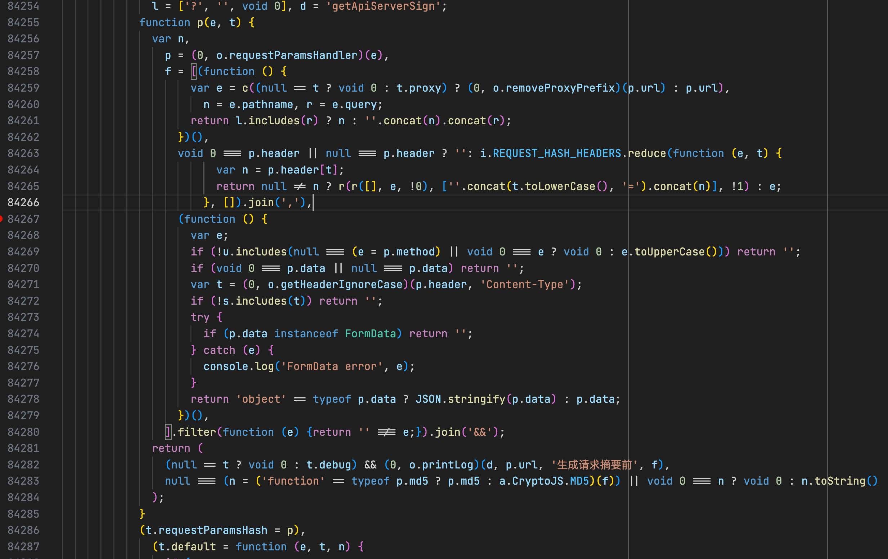
5. 找到`i`对应的`n(392)`函数,发现被混淆了;
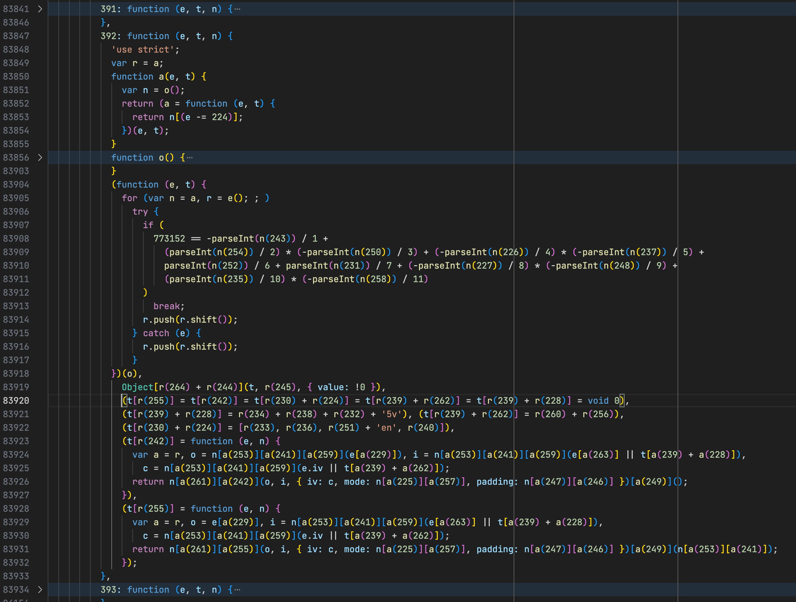
将`n(392)`函数的代码拷贝至`n392.js`，模拟混淆过程，用正则批量替换得到反混淆后的`n391_decrypt.js`
    ```javascript
    var n = i => {
    return e[i - 224];
    };
    var r = e;

    for (let index = 0; index < e.length; index++) {
    try {
        if (
        773152 == -parseInt(n(243)) / 1 +
            (parseInt(n(254)) / 2) * (-parseInt(n(250)) / 3) +
            (-parseInt(n(226)) / 4) * (-parseInt(n(237)) / 5) +
            parseInt(n(252)) / 6 + parseInt(n(231)) / 7 +
            (-parseInt(n(227)) / 8) * (-parseInt(n(248)) / 9) +
            (parseInt(n(235)) / 10) * (-parseInt(n(258)) / 11)
        )
        break;
        r.push(r.shift());
    } catch (e) {
        r.push(r.shift());
    }
    }

    const fs = require('fs');

    let data = fs.readFileSync('n392.js', 'utf8');

    for (let [index, item] of e.entries()) {
    data = data.replace(new RegExp(`r\\(${224 + index}\\)|a\\(${224 + index}\\)`, 'g'), `"${item}"`);
    }

    console.log(data);
    fs.writeFileSync('n392_decrypted.js', data);
    ```

6. 分析反混淆后的`n392_decrypt.js`,得到AES加密用的`KEY`和`IV`、计算MD5用的`REQUEST_HASH_HEADERS`
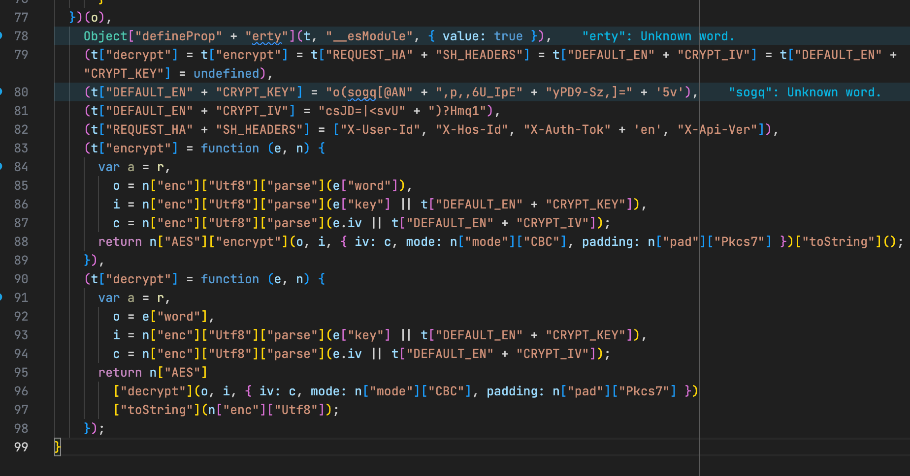

* DEFAULT_ENCRYPT_KEY = "o(sogq[@AN,p,,6U_IpEyPD9-Sz,]=5v"
* DEFAULT_ENCRYPT_IV = "csJD=|<svU)?Hmq1"
* REQUEST_HASH_HEADERS = ["X-User-Id", "X-Hos-Id", "X-Auth-Token', "X-Api-Ver"]

    尝试解密一个`X-Api-Key`的值,得到被AES加密前的数据
    ```python
    from Crypto.Cipher import AES
    from base64 import b64decode, b64encode
    from Crypto.Util.Padding import pad, unpad

    DEFAULT_ENCRYPT_KEY = b"o(sogq[@AN,p,,6U_IpEyPD9-Sz,]=5v"
    DEFAULT_ENCRYPT_IV = b"csJD=|<svU)?Hmq1"

    encrypted_b64 = "<X-Api-Key>"

    cipher = AES.new(DEFAULT_ENCRYPT_KEY, AES.MODE_CBC, iv=DEFAULT_ENCRYPT_IV)
    decrypted = unpad(cipher.decrypt(b64decode(encrypted_b64)), AES.block_size).decode("utf-8")
    ```
    `json.loads(decrypted)`后的数据:
    ```json
    {
        "accessEntry": "local-patient-miniapp",
        "timestamp": 1735565655493,
        "replayNo": "4a43104a-5b76-4e21-9e7f-dee01c45b648",
        "hashDigest": "91e260d5bf94fc1eed38769b6cc71cd6",
    }
    ```
7. 综上，如果想要获取其他时间范围的检查报告，只需修改查询参数后，按照新的查询参数重新计算MD5值，替换被签名的原始数据中的`hashDigest`后，重新AES加密计算新的`<X-Api-Key>`即可
    ```python
    data["hashDigest"] = "<NEW MD5>"
    plain = json.dumps(data, separators=(",", ":"), ensure_ascii=False)
    encrypted = cipher.encrypt(pad(plain.encode("utf-8"), AES.block_size))
    encrypted_b64 = b64encode(encrypted).decode("utf-8")
    ```
8. 参照`p(e, t)`和`REQUEST_HASH_HEADERS`计算MD5值
    ```python
    import hashlib

    def calculate_md5(input_string):
        md5_hash = hashlib.md5()
        md5_hash.update(input_string.encode("utf-8"))
        return md5_hash.hexdigest()

    headers = {
        "X-User-Id": 12345678,
        "X-Hos-Id": 12345678,
        "X-Auth-Token": '<X-Auth-Token>',
        "X-Api-Ver": "2.26.7",
    }

    lst = list()
    lst.append(
        "/patient/v1/report/record?inspectType=UC&reportType=3&cardNos=xxxxx&startTime=2024-12-24&endTime=2024-12-31"
    )
    lst.append(",".join([f"{k.lower()}={v}" for k, v in headers.items()]))
    string_to_sign = "&&".join(lst)
    md5 = calculate_md5(string_to_sign)
    ```

## 修改请求
1. 打开`BrupSuite`的`Proxy Intercept`开关，以拦截小程序的请求
2. 打开🏥小程序，点击"查报告"
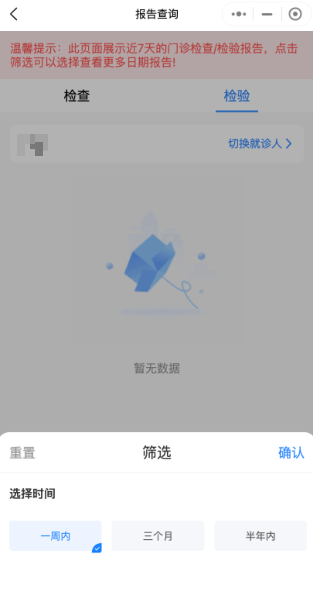
3. 从`Brup Suite`中复制`Path+Query`、`REQUEST_HASH_HEADERS`、`<X-Auth-Token>`和`<X-Api-Key>`对应的值
4. 执行Python脚本计算新的`<X-Api-Key>`，然后更新`Brup Suite`中的请求参数和`X-Api-Key`，点击`Forward`
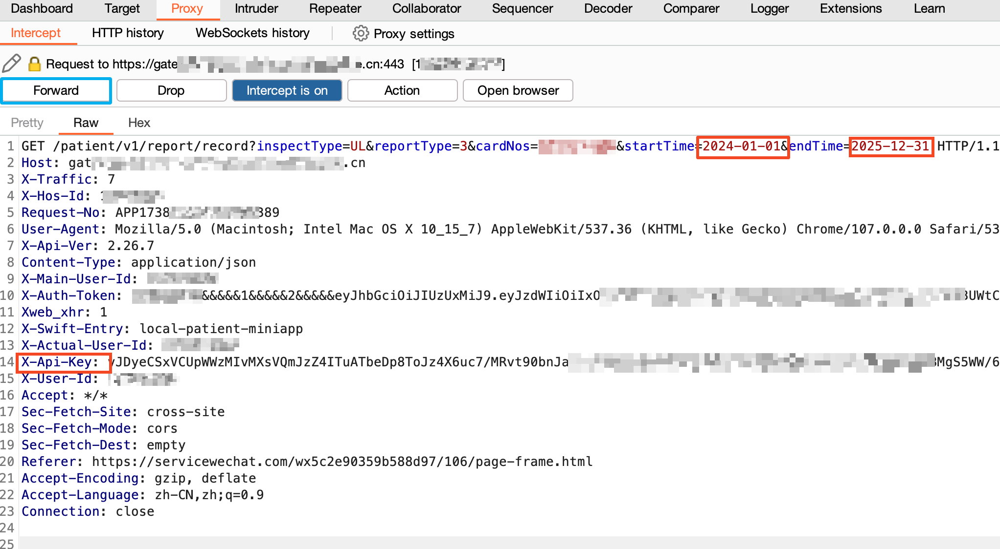

## 参考
* [mac下chrome导入burp证书 - CSDN](https://www.cnblogs.com/Hi-blog/p/How-To-Import-BurpSuite-Certificate-To-Chrome-On-MacOS.html)
* [Mac m2使用实现微信小程序抓包 - 博客园](https://www.cnblogs.com/mr-ryan/p/17680899.html)
* [使用wxappUnpacker工具进行MAC微信小程序反编译 - 掘金](https://juejin.cn/post/7360996405581381667)

## 完整代码
```python
import hashlib
import json
from base64 import b64decode, b64encode

from Crypto.Cipher import AES
from Crypto.Util.Padding import pad, unpad


def calculate_md5(input_string):
    md5_hash = hashlib.md5()
    md5_hash.update(input_string.encode("utf-8"))
    return md5_hash.hexdigest()


DEFAULT_ENCRYPT_KEY = b"o(sogq[@AN,p,,6U_IpEyPD9-Sz,]=5v"  # 32 字节密钥
DEFAULT_ENCRYPT_IV = b"csJD=|<svU)?Hmq1"  # 16 字节初始化向量


token = "<X-Auth-Token>"
x_user_id = "<X-User-Id>"
x_hos_id = "<X-Hos-Id>"

headers = {
    "X-User-Id": x_user_id,
    "X-Hos-Id": x_hos_id,
    "X-Auth-Token": token,
    "X-Api-Ver": "2.26.7",
}
encrypted_b64 = "<X-Api-Key>"

lst = list()
lst.append(
    "/patient/v1/report/record?inspectType=UL&reportType=3&cardNos=xxxxxx&startTime=2024-01-01&endTime=2024-12-31"
)  # 检验
lst.append(",".join([f"{k.lower()}={v}" for k, v in headers.items()]))
string_to_sign = "&&".join(lst)
md5 = calculate_md5(string_to_sign)
print("MD5", md5)

cipher = AES.new(DEFAULT_ENCRYPT_KEY, AES.MODE_CBC, iv=DEFAULT_ENCRYPT_IV)
decrypted = unpad(cipher.decrypt(b64decode(encrypted_b64)), AES.block_size).decode("utf-8")
print("decrypted", decrypted)

data = json.loads(decrypted)
data["hashDigest"] = md5

# Encrypt
cipher = AES.new(DEFAULT_ENCRYPT_KEY, AES.MODE_CBC, iv=DEFAULT_ENCRYPT_IV)
plain = json.dumps(data, separators=(",", ":"), ensure_ascii=False)
encrypted = cipher.encrypt(pad(plain.encode("utf-8"), AES.block_size))
encrypted_b64 = b64encode(encrypted).decode("utf-8")
print("encrypted_b64", encrypted_b64)
```